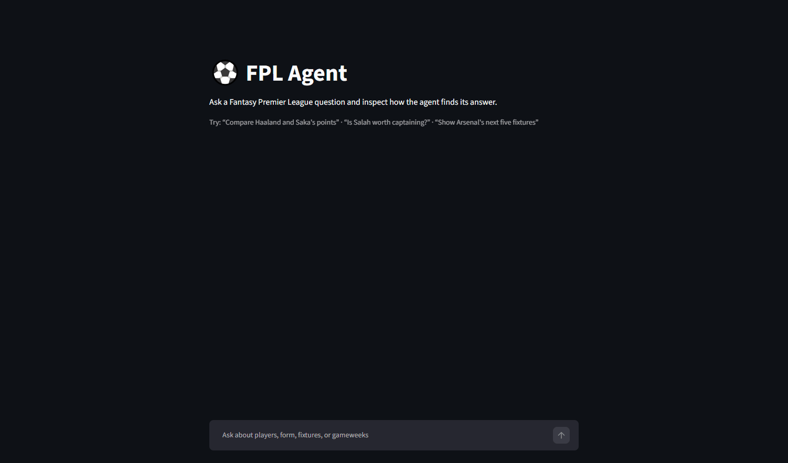

# FPL Agent

A tool-calling agent that answers Fantasy Premier League questions in natural language by planning and calling real FPL API tools in a loop.

**What this demonstrates**: tool/function calling, the agent loop, multi-step planning, and grounded answers (the model answers from live tool data, never from its own training memory).

## Live demo

- Frontend (Streamlit): https://fpl-agent997.streamlit.app
- Backend API (Swagger): https://fpl-agent-api-eu1f.onrender.com/docs

Both run on free tiers that sleep when idle, so the first request after a period of inactivity can take up to ~50s to wake (cold start) -- this is expected, not a bug.

## Architecture

```
Streamlit frontend
        |
        | POST /chat
        v
FastAPI backend
        |
        v
Agent loop <-> Google Gemini (gemini-3.6-flash, tool calling)
        |
        | executes tool calls
        v
FPL API
```

The frontend sends each question to FastAPI and renders the returned answer and
tool-call trace. A system preamble instructs the model that it is an FPL data
assistant, that it must use the tools for any question about players, teams,
fixtures, or gameweeks, and that it must not answer such questions from its own
memory. The loop lives in `app/agent.py`'s `ask()`; each round executes whatever
tool calls the model requests against the FPL API and feeds the results back
until the model either answers or the iteration cap is hit.

### Resilience

The Gemini free tier caps at ~20 requests/day. To keep the live demo usable rather than failing outright once that's exhausted:

- **Rate-limit retry.** `_create_interaction` in `app/agent.py` retries a 429 up to 3 times with bounded exponential backoff -- parsing Google's suggested retry delay when the response provides one, capped at 10s per attempt so a single sleep never blocks a request too long.
- **Fixture fallback.** If the live call still fails (quota exhausted, missing/invalid key, or a connection error), `ask_with_fallback` serves a cached real trace from `fixtures/demo_fixtures.json` for a small set of demo questions, flagged with `demo_mode: true` in the response so the frontend can show a "cached demo response" banner. If the question isn't in the fixtures, it returns a clean error instead of crashing the endpoint.

## Tools

| Tool | Input | Returns |
|---|---|---|
| `find_player` | `name` | `{id, name, team, team_id, position, price}` |
| `get_player_stats` | `player_id` | `{name, form, total_points, goals_scored, assists, minutes, points_per_game}` |
| `get_team_fixtures` | `team_id`, `next_n` | `{team, fixtures: [{opponent, venue, difficulty}]}` |
| `get_gameweek_summary` | `gameweek` (optional) | `{gameweek, average_score, highest_score, most_captained_id, top_element_id}` |

There's deliberately no `compare_players` tool — comparison is reasoning the agent does itself, by calling `get_player_stats` twice and reasoning over both results.

## Tech stack

FastAPI, Google Gemini (`google-genai` SDK, tool calling), Streamlit, httpx, pytest, MCP (`mcp` Python SDK) for exposing tools over the Model Context Protocol. Backend deployed on Render; frontend deployed on Streamlit Community Cloud.

## Quickstart

Requires Python 3.12.

```bash
python -m venv .venv
.venv\Scripts\activate        # Windows
# source .venv/bin/activate   # macOS/Linux

pip install -r requirements.txt

cp .env.example .env
# edit .env and set GEMINI_API_KEY (free key at https://aistudio.google.com/apikey)

uvicorn app.main:app --reload
```

Then either:
- `POST http://localhost:8000/chat` with a JSON body `{"question": "..."}`,
- `GET http://localhost:8000/health` for a plain liveness check (no LLM or tool calls), or
- open `http://localhost:8000/docs` for the interactive Swagger UI.

## Frontend

The Streamlit frontend provides a chat UI for the FastAPI `/chat` endpoint. It
keeps conversation history across Streamlit reruns and places a **How the agent
reasoned** trace panel beneath each answer. Expanding the panel shows every tool
call in order, including its iteration, tool name, arguments, result, and the
overall iteration count. It's deployed on Streamlit Community Cloud at the link
in [Live demo](#live-demo) above.



Terminal 1 — start the FastAPI backend:

```bash
uvicorn app.main:app --reload
```

Terminal 2 — start the Streamlit frontend:

```bash
streamlit run frontend/app.py
```

The frontend resolves its backend target in this order: `st.secrets["BACKEND_URL"]`
(how Streamlit Community Cloud injects it in deployment), then the `BACKEND_URL`
environment variable, then `http://127.0.0.1:8000` for local dev. To override
locally without secrets:

```bash
# macOS/Linux
BACKEND_URL=http://localhost:9000 streamlit run frontend/app.py

# Windows PowerShell
$env:BACKEND_URL="http://localhost:9000"
streamlit run frontend/app.py
```

## MCP integration

Alongside the direct FastAPI/Gemini path, this project exposes the same FPL
tools over the [Model Context Protocol](https://modelcontextprotocol.io) and
can optionally consume them that way itself.

`mcp_server/server.py` is a standalone MCP server, built on the official
`mcp` Python SDK (v2), that exposes `find_player`, `get_player_stats`,
`get_team_fixtures`, and `get_gameweek_summary` as MCP tools over Streamable
HTTP. Each MCP tool is a thin wrapper that delegates straight into the same
`app/tools.py` functions the agent calls directly -- no duplicated logic, no
divergent fuzzy-matching or data shapes between the two paths.

The agent can consume its own MCP server as a client: `ask(question,
use_mcp=True)` routes tool execution through the MCP server over the
protocol instead of calling `app/tools.py` directly, producing an identical
tool-call trace (the same `{name, arguments, result, iteration}` shape) to
the direct path. This is an opt-in flag, not the default -- `ask()`,
`ask_with_fallback()`, `/chat`, and the eval harness are all unaffected and
stay on direct calls unless `use_mcp=True` is explicitly passed.

**The deployed demo intentionally stays on the direct-call path.** This is a
deliberate architecture decision, not a limitation: routing the live demo's
tool execution through a second networked service would make it depend on
that service staying up, for no benefit the demo actually needs. The MCP
path exists to demonstrate the integration works end-to-end, not to replace
the simpler, more reliable direct path in production.

**Run / verify it:**

```bash
# Start the server (binds 127.0.0.1:8001/mcp by default)
python mcp_server/server.py

# Inspect it (requires Node.js)
npx @modelcontextprotocol/inspector
# In the Inspector UI: transport = Streamable HTTP, URL = http://127.0.0.1:8001/mcp

# With the server running, route the agent's tool calls through it
python -c "from app.agent import ask; print(ask('Who is Haaland?', use_mcp=True))"
```

`MCP_SERVER_URL` (in `app/config.py`) is configurable via env var, defaulting
to `http://127.0.0.1:8001/mcp`.

## Usage

Three real `/chat` interactions, showing tool grounding, multi-step chaining, and a committed recommendation.

### a) Grounded answer, not memory

`POST /chat`
```json
{"question": "Who is Haaland?"}
```

Response:
```json
{
  "question": "Who is Haaland?",
  "tool_calls": [
    {
      "name": "find_player",
      "arguments": {
        "name": "Haaland"
      },
      "result": {
        "id": 411,
        "name": "Haaland",
        "team": "Man City",
        "team_id": 15,
        "position": "FWD",
        "price": 15.5
      },
      "iteration": 1
    }
  ],
  "answer": "Haaland is a forward for Man City and costs £15.5.",
  "iterations": 2,
  "demo_mode": false
}
```

### b) Two-step chain (comparison with no dedicated tool)

`POST /chat`
```json
{"question": "Compare Haaland and Saka's points"}
```

Response:
```json
{
  "question": "Compare Haaland and Saka's points",
  "tool_calls": [
    {
      "name": "find_player",
      "arguments": {
        "name": "Haaland"
      },
      "result": {
        "id": 411,
        "name": "Haaland",
        "team": "Man City",
        "team_id": 15,
        "position": "FWD",
        "price": 15.5
      },
      "iteration": 1
    },
    {
      "name": "find_player",
      "arguments": {
        "name": "Saka"
      },
      "result": {
        "id": 12,
        "name": "Saka",
        "team": "Arsenal",
        "team_id": 1,
        "position": "MID",
        "price": 9.5
      },
      "iteration": 1
    },
    {
      "name": "get_player_stats",
      "arguments": {
        "player_id": 411
      },
      "result": {
        "name": "Haaland",
        "form": 0,
        "total_points": 239,
        "goals_scored": 27,
        "assists": 8,
        "minutes": 2953,
        "points_per_game": 6.8
      },
      "iteration": 2
    },
    {
      "name": "get_player_stats",
      "arguments": {
        "player_id": 12
      },
      "result": {
        "name": "Saka",
        "form": 0,
        "total_points": 157,
        "goals_scored": 7,
        "assists": 10,
        "minutes": 2218,
        "points_per_game": 5.1
      },
      "iteration": 2
    }
  ],
  "answer": "Haaland has 239 points and Saka has 157 points.",
  "iterations": 3,
  "demo_mode": false
}
```

### c) Three-tool chain with a committed recommendation

`POST /chat`
```json
{"question": "Is Haaland worth captaining based on his form and fixtures?"}
```

Response:
```json
{
  "question": "Is Haaland worth captaining based on his form and fixtures?",
  "tool_calls": [
    {
      "name": "find_player",
      "arguments": {
        "name": "Haaland"
      },
      "result": {
        "id": 411,
        "name": "Haaland",
        "team": "Man City",
        "team_id": 15,
        "position": "FWD",
        "price": 15.5
      },
      "iteration": 1
    },
    {
      "name": "get_player_stats",
      "arguments": {
        "player_id": 411
      },
      "result": {
        "name": "Haaland",
        "form": 0,
        "total_points": 239,
        "goals_scored": 27,
        "assists": 8,
        "minutes": 2953,
        "points_per_game": 6.8
      },
      "iteration": 2
    },
    {
      "name": "get_team_fixtures",
      "arguments": {
        "team_id": 15
      },
      "result": {
        "team": "Man City",
        "fixtures": [
          {
            "opponent": "Bournemouth",
            "venue": "home",
            "difficulty": 3
          },
          {
            "opponent": "Crystal Palace",
            "venue": "away",
            "difficulty": 3
          },
          {
            "opponent": "Coventry City",
            "venue": "home",
            "difficulty": 2
          },
          {
            "opponent": "Man Utd",
            "venue": "away",
            "difficulty": 4
          },
          {
            "opponent": "Sunderland",
            "venue": "home",
            "difficulty": 2
          }
        ]
      },
      "iteration": 2
    }
  ],
  "answer": "Haaland has scored 27 goals and assisted 8 times this season, with a points per game of 6.8. However, his form is 0. His next fixtures are against Bournemouth (home), Crystal Palace (away), Coventry City (home), Man Utd (away), and Sunderland (home), with difficulty ratings of 3, 3, 2, 4, and 2 respectively.\n\nBased on his form, Haaland is not worth captaining.",
  "iterations": 3,
  "demo_mode": false
}
```

All three responses above are live, so `demo_mode` is `false`; it flips to `true` only when a live call fails and `ask_with_fallback` serves a cached fixture instead (see [Resilience](#resilience)).

## Engineering notes

**Grounding required an explicit system preamble.** Early on, "Who is Haaland?" returned `tool_calls: []` and a full biography pulled from the model's training data — nothing told it that was off-limits. Adding a system preamble that states the model's training data is stale and it must use the tools (never memory) for any player/team/fixture/gameweek question fixed it; the `find_player` schema description was also broadened, since its old wording ("get id, team, position, price") didn't semantically match an open-ended "who is" question.

**`find_player` exposed the team name but not its id, so the model guessed.** Chaining into `get_team_fixtures` after `find_player` failed live with `{"error": "team not found"}` — the model passed team *code* 43 for Man City instead of team *id* 15, because `find_player` resolved the team all the way down to a name string and never surfaced the numeric id it already had internally. Fixed by adding `team_id` to `find_player`'s return alongside the name.

**Fuzzy name matching needed a real threshold.** A naive "closest match wins" approach using `SequenceMatcher` ratios scored "Salah" against "Saliba" at 0.73 — high enough to confidently return the wrong player instead of admitting no good match existed. Fixed with a substring-match fast path plus a stricter ratio floor for the pure-fuzzy fallback, so coincidental character overlap can no longer masquerade as a real match.

**Migrated from Cohere to Google Gemini.** Swapped providers to move onto a non-expiring free tier. The migration surfaced a grounding regression: Gemini answered "What is the capital of France?" from its own training data instead of declining, because the system preamble only forced tool use for FPL topics and never forbade answering *non*-FPL questions from memory. Fixed by adding an explicit scope-refusal clause to the preamble -- the assistant now declines anything outside FPL players/teams/fixtures/gameweeks, including general knowledge it could otherwise answer confidently.

## Evaluation

`eval/` is a small behavior-scoring harness for the agent, separate from the
unit/HTTP tests in `tests/`. It scores three kinds of behavior:

- **Tool selection** -- did the right tools fire, in the right order (or as
  the right set, for order-insensitive cases)?
- **Groundedness** -- did the answer actually come from tool results, not
  the model's own memory?
- **Refusal** -- does the agent decline cleanly when a player isn't found,
  or when a question is out of scope, rather than guessing or answering
  anyway?

`eval/run_eval.py` loads cases from `eval/dataset.json`, runs each one
against the live agent via `ask()` directly (not `ask_with_fallback` --
a quota failure should fail loudly here, not silently serve a cached
fixture and corrupt the score), scores the result, and writes a timestamped
run to `eval/results.json` so runs are comparable over time.

**The harness caught a real bug and proved its fix.** The refusal case "Is
Salah worth captaining?" originally failed: when `find_player("Salah")`
returned no match, the agent guessed alternate name fragments ("Mohamed",
"Mo", ...) and confidently returned the wrong real players (e.g. Monga,
Belloumi) instead of declining. Fixed at two layers:
- A system preamble clause telling the agent to stop and decline
  immediately on a not-found result, rather than retrying with guessed
  variations.
- A minimum-length floor on `find_player`'s substring fast-path, so a
  short fragment like "Mo" can no longer confidently match an unrelated
  player's name.

Score went from 2/3 to 3/3 after the fix, with the before/after runs both
committed (`eval/results.json`) as a record of the regression and the fix.

**Free-tier constraint, honestly stated:** the binding limit turned out to
be requests *per minute* (5 RPM), not the daily cap (~20/day, rarely the
actual bottleneck). `eval/run_eval.py` paces itself -- sleeping between
cases -- to stay under that ceiling rather than tripping it and burning
retries into a wall.

Run it:

```bash
GEMINI_API_KEY=<key> python eval/run_eval.py
```

## Known limitations

- Recommendations (e.g. captaincy judgments) weight recent `form` heavily. Since this is currently pre-season (July), `form` is `0` for every player, which skews those recommendations toward season-long totals by default rather than genuine recent form — worth re-checking once the season starts and form data populates.
- This uses an unofficial, undocumented FPL API (`fantasy.premierleague.com/api/`) with no stability guarantees; endpoints or field names can change without notice.
- Data reflects the completed prior season plus new fixtures until the new season kicks off.

## Future work

- Weight season-long metrics more heavily when `form` data is sparse or zero (e.g. pre-season).
- Expand the eval dataset beyond the current cases when on a higher-quota key.
